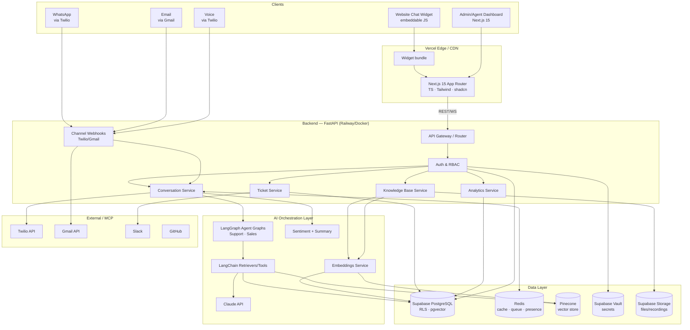
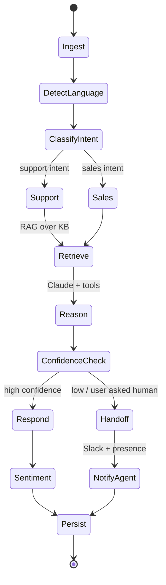

# OmniAssist AI — System Architecture

> Phase 1 · v1.0 · Companion to `03-Database-Design.md` and `04-API-Auth-Architecture.md`

## 1. Architecture Style

- **Multi-tenant SaaS**, modular monolith backend (FastAPI) that can split into services later.
- **Event-driven** for channel ingestion and background AI jobs (queue-backed).
- **AI orchestration** via **LangGraph** stateful agent graphs; **LangChain** for tool/retriever glue; **Claude** as the LLM.
- **RAG** with **Pinecone** (primary) + **pgvector** (fallback/cheap tier).

## 2. High-Level Diagram (C4 — Container level)



## 3. Logical Layers

| Layer | Responsibility | Tech |
|-------|----------------|------|
| **Presentation** | Dashboard, chat widget, marketing site | Next.js 15, TS, Tailwind, shadcn, Magic/Aceternity UI, Framer Motion |
| **API / BFF** | REST + WebSocket, auth, request validation | FastAPI, Pydantic, Uvicorn |
| **Domain services** | Conversations, tickets, KB, analytics, RBAC | FastAPI modules (service + repository pattern) |
| **AI orchestration** | Agent graphs, retrieval, tools, sentiment, summaries | LangGraph, LangChain, Claude, Pinecone |
| **Integration** | Channel webhooks + outbound (Twilio, Gmail, Slack) | MCP servers + provider SDKs |
| **Data** | Relational + vector + cache + blob + secrets | Supabase Postgres (pgvector), Pinecone, Redis, Supabase Storage, Vault |

## 4. The AI Agent (LangGraph) — Conceptual Graph



- **Tools available to agent:** `kb_search`, `create_ticket`, `update_ticket`, `book_demo`, `escalate_to_human`, `send_whatsapp`, `lookup_order` (extensible per tenant).
- **State** persisted per conversation (LangGraph checkpointer → Postgres/Redis) so multi-turn + handoff retain context.

## 5. Channel Ingestion Pipeline

```
Inbound (WhatsApp/Email/Voice/Web)
  → Channel Webhook (verify signature)
  → Normalize to canonical Message
  → Enqueue (Redis / pgmq)
  → Agent Worker (LangGraph run)
  → Persist + stream response
  → Outbound via provider (Twilio/Gmail/WS)
```

## 6. Real-time

- **WebSocket** (FastAPI) for live dashboard: new messages, presence, typing, handoff signals.
- **Redis pub/sub** to fan out events across API instances.
- **Supabase Realtime** optionally for DB-change subscriptions on the frontend.

## 7. Background Jobs

| Job | Trigger | Runner |
|-----|---------|--------|
| Document embedding | KB upload | Worker (Celery/RQ) or pgmq + worker |
| Site crawl | Manual/scheduled | Worker + Playwright MCP |
| Daily analytics rollups | `pg_cron` / scheduler | Postgres job + service |
| SLA breach checks | Cron | Scheduler → Slack |
| Conversation summary | On close/handoff | Worker (Claude) |

## 8. Scalability & Resilience

- Stateless API → horizontal scale behind load balancer.
- Vector tiering: pgvector for small tenants, Pinecone for large → cost-aware.
- Per-tenant rate limits + token budgets (Redis counters).
- Circuit breakers around Claude/Twilio; retries with backoff; dead-letter queue.
- Graceful degradation: if Pinecone down → fall back to pgvector; if Claude down → queue + canned holding reply.

## 9. Observability

- Structured JSON logs (request id, org id, conversation id).
- Metrics: latency, token usage, deflection, error rates (Prometheus-compatible).
- Tracing across agent graph nodes (LangSmith-style or OpenTelemetry).
- Audit logs in Postgres (immutable, see DB design).

## 10. Security Architecture (summary — details in 04)

- JWT (access + refresh), Supabase Auth as IdP.
- Postgres **Row-Level Security** keyed by `org_id`.
- Secrets in **Supabase Vault** / `pgcrypto`; never in app DB plaintext.
- Signed webhooks (Twilio signature, Gmail push verification).
- PII redaction layer before logging.
