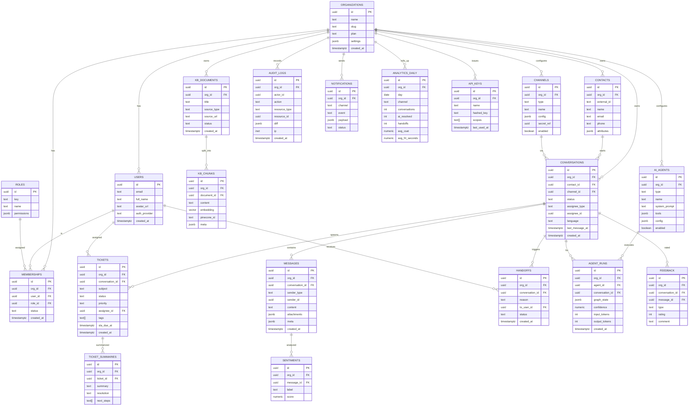

# OmniAssist AI — Database Design & ER Diagram

> Phase 1 · v1.0 · Target: Supabase PostgreSQL (project `pfcfrberlamzpopmbthr`)
> Extensions used: `uuid-ossp`, `pgcrypto`, `vector` (pgvector 0.8.0), `pg_trgm`, `pgmq`, `pg_cron`.
> **Multi-tenancy:** every business table carries `org_id` + Row-Level Security.

## 1. ER Diagram



## 2. Table Catalog (purpose + notes)

| Table | Purpose | Notes |
|-------|---------|-------|
| `organizations` | Tenant root | `plan` drives limits; `settings` jsonb |
| `users` | Global identity | Linked to Supabase Auth `auth.users.id` |
| `roles` | RBAC roles | Seeded: owner, admin, agent, viewer |
| `memberships` | user↔org↔role | A user can belong to many orgs |
| `channels` | Channel config | `type` ∈ web, whatsapp, email, voice; secret in Vault |
| `contacts` | End customers | Dedup by email/phone/external_id |
| `conversations` | Thread of messages | `status` ∈ open, pending, resolved, snoozed |
| `messages` | Individual messages | `sender_type` ∈ contact, ai, agent, system |
| `tickets` | Work items | SLA timers, priority, assignment |
| `handoffs` | AI→human events | Carries reason + context pointer |
| `kb_documents` | KB sources | upload/crawl/faq; status: processing/ready/failed |
| `kb_chunks` | Embedded chunks | `embedding vector(1536/3072)` + `pinecone_id` |
| `ai_agents` | Agent configs | support/sales; prompt + tools + model config |
| `agent_runs` | Each AI turn | tokens, confidence, graph state for replay/handoff |
| `sentiments` | Per-message sentiment | label + score |
| `ticket_summaries` | AI summaries | on close/handoff |
| `feedback` | Thumbs + CSAT | per message/conversation |
| `audit_logs` | Immutable audit | append-only; no UPDATE/DELETE |
| `notifications` | Outbound events | slack/email; status queued/sent/failed |
| `analytics_daily` | Pre-aggregated metrics | filled by `pg_cron` rollup |
| `api_keys` | Tenant API access | hashed; scopes |

## 3. Key Design Decisions

1. **UUID PKs** (`uuid_generate_v4()`), `created_at timestamptz default now()` everywhere.
2. **`org_id` on every business table** + **RLS** policy `org_id = auth.jwt() ->> 'org_id'`.
3. **Vector storage dual-path:**
   - `kb_chunks.embedding vector(N)` with **HNSW** index for pgvector tier.
   - `kb_chunks.pinecone_id` references the same chunk in Pinecone (namespace = `org_id`).
4. **Soft delete** via `deleted_at` on content tables; audit logs are hard-append-only.
5. **Indexes:** `conversations(org_id, status, last_message_at)`, `messages(conversation_id, created_at)`, `tickets(org_id, status, sla_due_at)`, `kb_chunks` HNSW + `pinecone_id`, `pg_trgm` on `contacts(name,email)`.
6. **Enums** implemented as `text` + `CHECK` constraints (easier migrations than PG enums).

## 4. RLS Policy Pattern (illustrative, not executed yet)

```sql
-- Example only — applied via migrations in Phase 2
alter table conversations enable row level security;

create policy tenant_isolation_select on conversations
  for select using (org_id = (auth.jwt() ->> 'org_id')::uuid);

create policy tenant_isolation_mod on conversations
  for all using (org_id = (auth.jwt() ->> 'org_id')::uuid)
          with check (org_id = (auth.jwt() ->> 'org_id')::uuid);
```

## 5. Vector Index (pgvector tier, illustrative)

```sql
create index on kb_chunks using hnsw (embedding vector_cosine_ops);
```

## 6. Migration Strategy

- Managed via **Supabase migrations** (`supabase/migrations/*.sql`), applied with `apply_migration` MCP tool in Phase 2.
- One migration per logical group: `0001_core_tenancy`, `0002_channels_contacts`, `0003_conversations_messages`, `0004_tickets_handoffs`, `0005_kb_vectors`, `0006_ai_agents_runs`, `0007_analytics_audit`, `0008_rls_policies`, `0009_seed_roles`.
