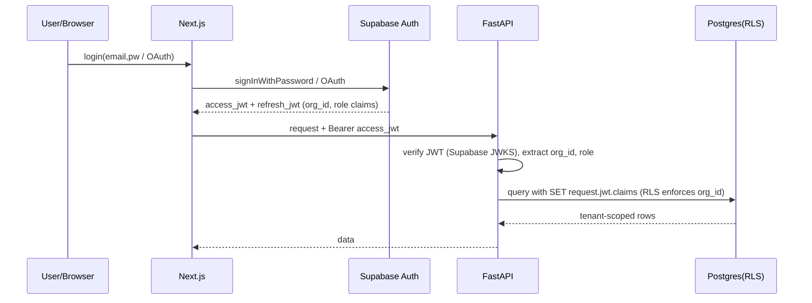

# OmniAssist AI — API & Authentication Architecture

> Phase 1 · v1.0 · Backend: FastAPI · Auth: Supabase Auth (JWT) + RBAC + RLS

## 1. API Design Principles

- **REST + JSON** for CRUD; **WebSocket** for realtime; **webhooks** for inbound channels.
- Versioned under `/api/v1`. Resource-oriented, plural nouns.
- All requests authenticated except public widget + webhooks (which use signatures/keys).
- Tenant scope derived from JWT (`org_id`), never from request body → prevents cross-tenant access.
- Standard envelope: `{ "data": ..., "error": null, "meta": { pagination } }`.

## 2. REST Endpoint Map (v1)

### Auth & Org
| Method | Path | Purpose |
|--------|------|---------|
| POST | `/api/v1/auth/signup` | Create user + org |
| POST | `/api/v1/auth/login` | Email/password or OAuth → JWT |
| POST | `/api/v1/auth/refresh` | Refresh access token |
| GET | `/api/v1/me` | Current user + memberships |
| POST | `/api/v1/orgs` | Create org |
| GET/PATCH | `/api/v1/orgs/:id` | Read/update org settings |

### Members & RBAC
| Method | Path | Purpose |
|--------|------|---------|
| GET | `/api/v1/members` | List members |
| POST | `/api/v1/members/invite` | Invite by email |
| PATCH | `/api/v1/members/:id/role` | Change role (audited) |
| DELETE | `/api/v1/members/:id` | Remove member |

### Channels
| Method | Path | Purpose |
|--------|------|---------|
| GET/POST | `/api/v1/channels` | List/create channel |
| PATCH/DELETE | `/api/v1/channels/:id` | Update/remove |
| POST | `/api/v1/channels/:id/test` | Verify connectivity |

### Conversations & Messages
| Method | Path | Purpose |
|--------|------|---------|
| GET | `/api/v1/conversations` | List (filters: status, channel, assignee) |
| GET | `/api/v1/conversations/:id` | Detail + messages |
| POST | `/api/v1/conversations/:id/messages` | Agent sends message |
| POST | `/api/v1/conversations/:id/handoff` | Trigger/accept handoff |
| POST | `/api/v1/conversations/:id/resolve` | Resolve |
| WS | `/ws/conversations` | Realtime stream |

### Tickets
| Method | Path | Purpose |
|--------|------|---------|
| GET/POST | `/api/v1/tickets` | List/create |
| GET/PATCH | `/api/v1/tickets/:id` | Read/update (status, assignee, priority) |
| GET | `/api/v1/tickets/:id/summary` | AI summary |

### Knowledge Base
| Method | Path | Purpose |
|--------|------|---------|
| GET/POST | `/api/v1/kb/documents` | List/upload doc |
| POST | `/api/v1/kb/crawl` | Crawl a site (Playwright) |
| DELETE | `/api/v1/kb/documents/:id` | Delete (re-index) |
| POST | `/api/v1/kb/search` | Debug retrieval |

### AI Agents
| Method | Path | Purpose |
|--------|------|---------|
| GET/POST | `/api/v1/agents` | List/create agent config |
| PATCH | `/api/v1/agents/:id` | Update prompt/tools/model |
| POST | `/api/v1/agents/:id/test` | Test prompt in sandbox |

### Analytics & Feedback
| Method | Path | Purpose |
|--------|------|---------|
| GET | `/api/v1/analytics/overview` | KPIs by range/channel |
| GET | `/api/v1/analytics/timeseries` | Charts data |
| POST | `/api/v1/feedback` | Submit thumbs/CSAT |
| GET | `/api/v1/audit-logs` | Paginated audit (admin) |

### Public (no JWT)
| Method | Path | Purpose |
|--------|------|---------|
| POST | `/api/v1/public/widget/message` | Widget message (org public key) |
| POST | `/webhooks/twilio/whatsapp` | Inbound WhatsApp (signed) |
| POST | `/webhooks/twilio/voice` | Inbound Voice (signed) |
| POST | `/webhooks/gmail/push` | Gmail push (verified) |

## 3. Authentication Architecture

- **IdP:** Supabase Auth (email/password + OAuth: Google, GitHub). Issues JWT.
- **Custom claims:** `org_id`, `role`, `membership_id` injected via Supabase Auth Hook / on-login enrichment.
- **Token lifetimes:** access ~15 min, refresh ~30 days (rotating).
- **Service-to-service / channel webhooks:** HMAC signature verification (Twilio) + per-org API keys (hashed, scoped) for the public API and widget.

## 4. Authorization (RBAC)

| Role | Permissions (high level) |
|------|--------------------------|
| **Owner** | Everything incl. billing, delete org, manage admins |
| **Admin** | Manage members, channels, KB, agents, view audit |
| **Agent** | Handle conversations/tickets, take handoffs, KB read |
| **Viewer** | Read-only dashboards/analytics |

- Permissions stored as JSON on `roles.permissions` (e.g. `["tickets:write","kb:read"]`).
- Enforced at **two layers**: (1) FastAPI dependency `require_permission("tickets:write")`, (2) Postgres **RLS** as defense-in-depth.
- Every role/permission-changing action writes an `audit_logs` row.

## 5. Security Controls

| Control | Implementation |
|---------|----------------|
| Tenant isolation | Postgres RLS on `org_id` + JWT claim |
| Secret storage | Supabase Vault / `pgcrypto` for channel tokens, SMTP, API keys |
| Webhook auth | Twilio signature header; Gmail push verification |
| Rate limiting | Redis token bucket per IP/org/key |
| Input validation | Pydantic models on every endpoint |
| PII handling | Redaction middleware before logs; encrypted at rest |
| CORS | Allowlist dashboard + widget origins |
| Audit | Immutable append-only `audit_logs` |
| Token budgets | Per-tenant LLM spend caps (Redis counters) |

## 6. Error Handling & Conventions

- Consistent error codes: `AUTH_401`, `FORBIDDEN_403`, `VALIDATION_422`, `RATE_LIMIT_429`, `INTERNAL_500`.
- Idempotency keys for webhook + outbound message endpoints.
- Pagination: cursor-based (`?cursor=&limit=`) on high-volume lists.
