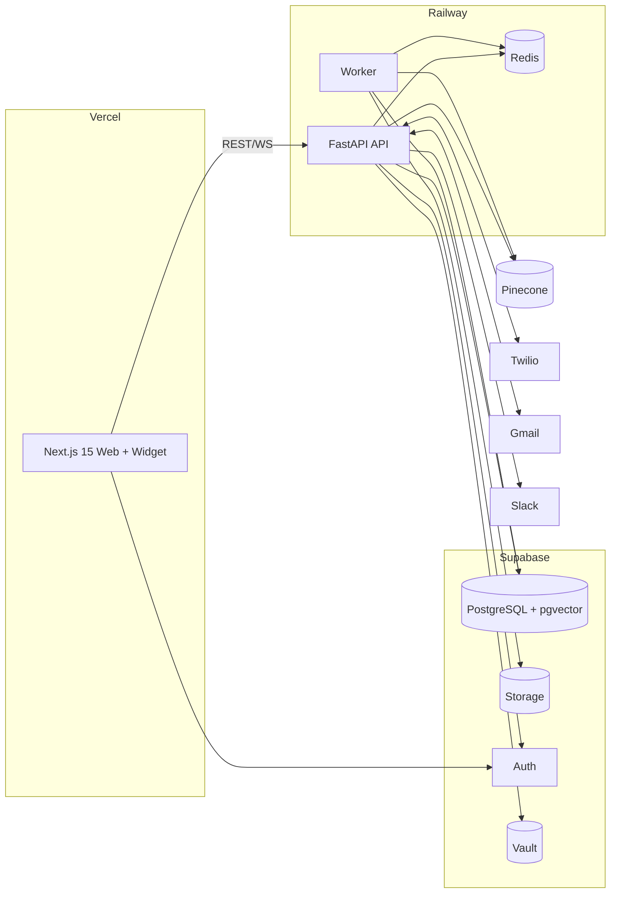

# OmniAssist AI — Deployment Architecture & Development Roadmap

> Phase 1 · v1.0

## Part A — Deployment Architecture

### 1. Topology



### 2. Environments

| Env | Web | API/Worker | DB | Purpose |
|-----|-----|-----------|----|---------|
| **dev** | local / Vercel preview | local Docker | Supabase (current project) | build & test |
| **staging** | Vercel preview | Railway staging | Supabase branch | QA, demos |
| **production** | Vercel prod | Railway prod | Supabase prod | live |

### 3. Hosting Choices

- **Frontend:** Vercel (Edge, preview deploys per PR, image optim).
- **Backend API + Worker:** Railway (Docker services, autoscale, Redis add-on).
- **DB/Auth/Storage:** Supabase (managed Postgres + pgvector + Auth + Storage + Vault).
- **Vector:** Pinecone (managed) for scale tier.
- **Containers:** Docker for API/worker; `docker-compose` for local full stack.

### 4. CI/CD (GitHub Actions)

```
PR opened → lint + typecheck + unit tests (web, api)
          → build Docker images
          → Vercel preview + Railway preview
          → E2E (Playwright) on preview
merge to main → deploy staging → smoke tests → manual gate → production
DB → supabase migrations applied via CI (or CLI) before API deploy
```

### 5. Observability & Ops

- Logs: structured JSON → Railway/Vercel log drains.
- Metrics/health: `/healthz`, `/readyz`; uptime monitor.
- Error tracking: Sentry (web + api).
- Alerts: Slack (deploy status, error spikes, SLA breaches).
- Backups: Supabase PITR; Pinecone re-indexable from Postgres source of truth.

### 6. Cost & Scaling Levers

- pgvector tier for small tenants → defer Pinecone cost.
- Redis caching of retrievals + token budgets per org.
- Worker autoscale on queue depth.
- CDN/edge for widget + static.

---

## Part B — Development Roadmap

### Milestone 0 — Foundations (Phase 2, Sprint 1)
- [ ] Create GitHub repo + monorepo scaffold (Turborepo).
- [ ] Supabase migrations 0001–0009 + RLS + seed roles.
- [ ] Generate TS types; set up env schema + secrets.
- [ ] Base Next.js shell (dark theme, nav, cmd-K) + FastAPI skeleton + auth.

### Milestone 1 — Core Conversations (Sprint 2)
- [ ] Auth + RBAC end-to-end (signup/login/org/roles).
- [ ] Conversations + Messages CRUD + WebSocket streaming.
- [ ] Website chat widget (embeddable) + public message endpoint.
- [ ] Inbox UI (3-pane) with live updates.

### Milestone 2 — AI + RAG (Sprint 3)
- [ ] Knowledge Base upload + chunk + embed (pgvector + Pinecone).
- [ ] LangGraph support agent (retrieve → reason → respond → confidence).
- [ ] Source citations + confidence gating + auto-handoff.
- [ ] Agent config UI + test sandbox.

### Milestone 3 — Tickets + Handoff (Sprint 4)
- [ ] Ticket lifecycle, SLA timers, assignment.
- [ ] Human handoff flow + presence.
- [ ] AI ticket summaries + sentiment analysis.

### Milestone 4 — Channels (Sprint 5)
- [ ] WhatsApp via Twilio (inbound/outbound, media, templates).
- [ ] Email Agent via Gmail (parse + reply).
- [ ] Voice via Twilio (IVR → AI → transcription → summary).
- [ ] Multi-language support.

### Milestone 5 — Sales + Analytics + Governance (Sprint 6)
- [ ] AI Sales Agent (BANT qualification, demo booking).
- [ ] Analytics dashboard (deflection, CSAT, FRT, channel).
- [ ] Feedback system + Slack notifications.
- [ ] Audit logs UI + export.

### Milestone 6 — Hardening & Launch (Sprint 7)
- [ ] Security pass (RLS tests, secret rotation, rate limits, PII redaction).
- [ ] Load/perf testing; cost guardrails.
- [ ] E2E test suite green; staging → production.
- [ ] Docs, onboarding, billing/plan gating.

### Cross-cutting (every sprint)
- Tests (unit + E2E), CI green, accessibility, observability, security review.

---

## Pre-Phase-2 Action Items (need your input/credentials)

1. **Supabase MCP is read-only** — allow write (relaunch without `--read-only`) or we use Supabase CLI for migrations.
2. **Slack** — provide `SLACK_BOT_TOKEN` + `SLACK_TEAM_ID`.
3. **Gmail** — complete OAuth auto-auth.
4. **Twilio** — confirm OK to buy a number; top up balance for production.
5. **Pinecone** — confirm embedding model/dims (affects index + schema vector size).
6. **Figma** — share a `fileKey`, or approve code-first design.
7. **GitHub** — confirm repo name `omniassist-ai` and public/private. ⚠️ Rotate the live tokens currently in `.mcp.json` before any push.
8. **LLM** — confirm Claude model + an Anthropic API key for the app runtime.
