# OmniAssist AI — Complete User Flows & Journeys

> v1.0 · Flows for Customer, Support Agent, Sales Agent, Admin. Mermaid diagrams.

## A. CUSTOMER FLOWS

### A1. Website Chat
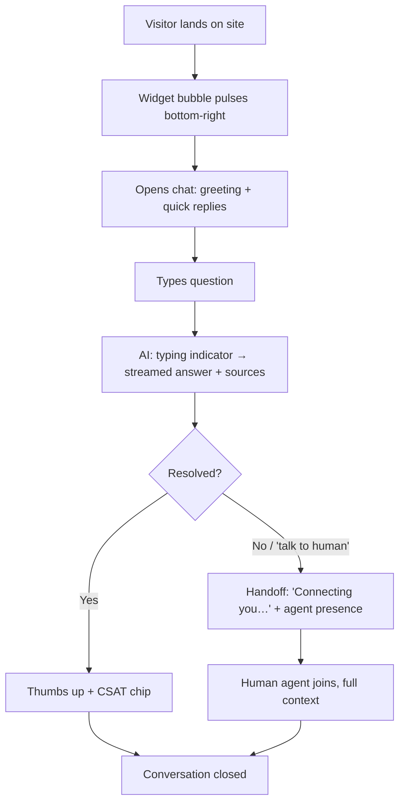
**UX notes:** instant first token, source pills under answers, persistent transcript, "still typing" never blocks input, offline → capture email.

### A2. WhatsApp Support
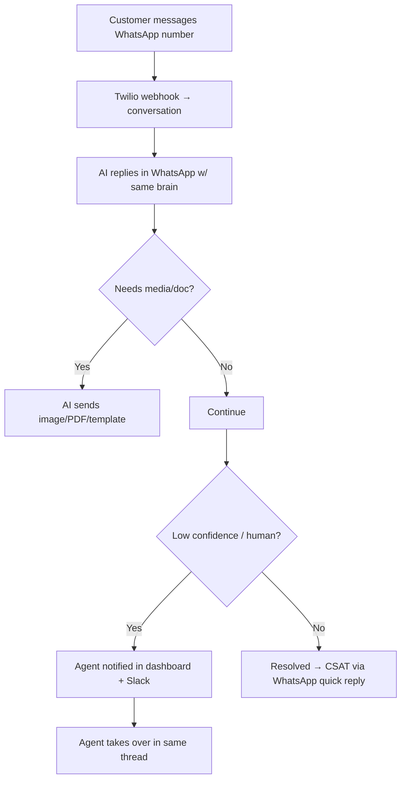

### A3. Voice Support
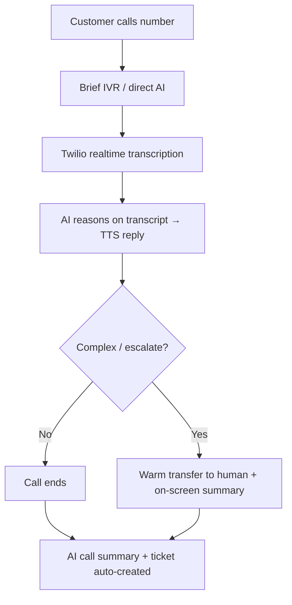

### A4. Email Support
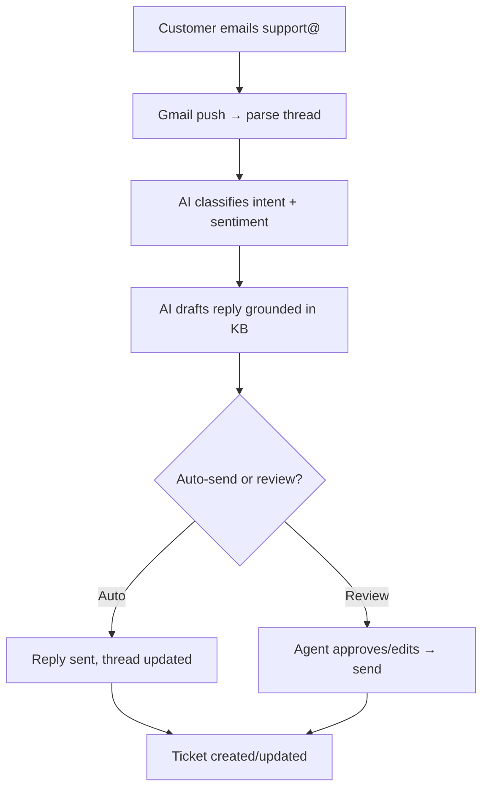

### A5. Ticket Tracking (customer self-serve)
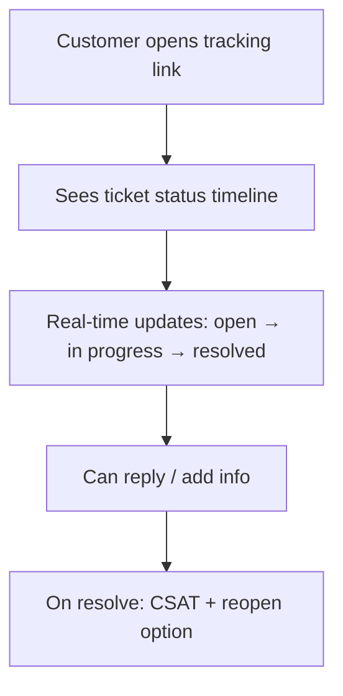

## B. SUPPORT AGENT FLOWS

### B1. Dashboard → Ticket Handling
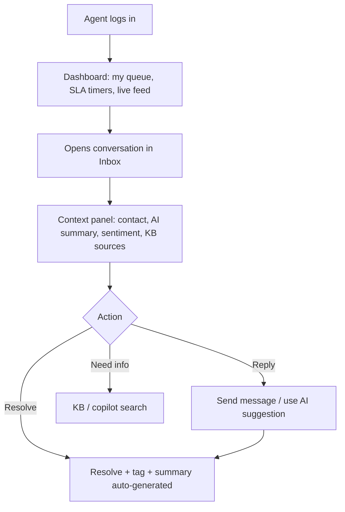

### B2. Human Handoff (receiving)
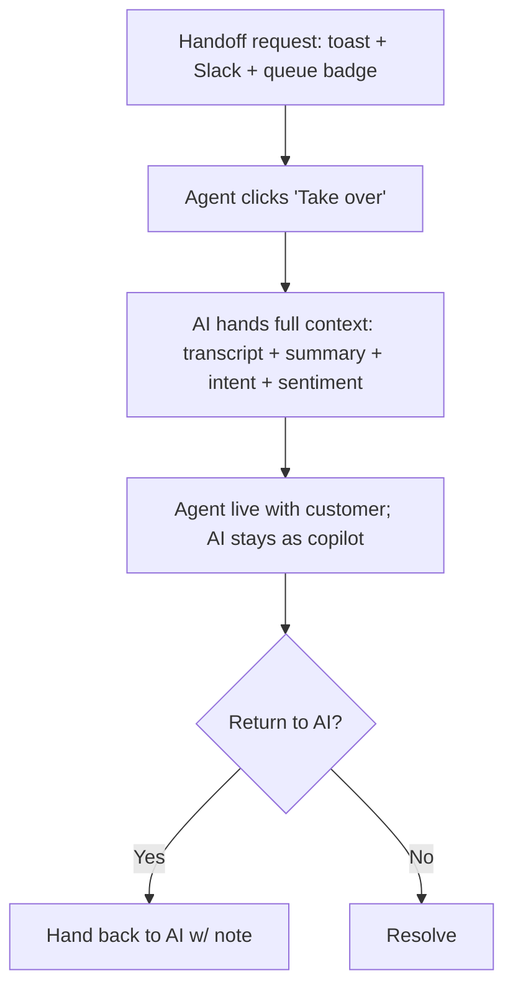

### B3. Analytics (agent view)
Personal stats: resolved, avg handle time, CSAT, SLA adherence → trend cards + leaderboard (opt-in).

## C. SALES AGENT FLOWS

### C1. Lead Management
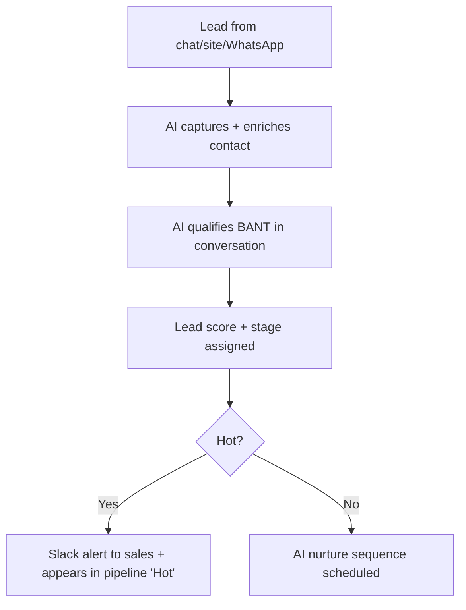

### C2. Pipeline Tracking
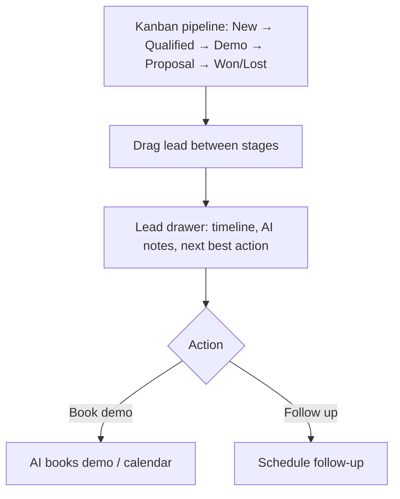

### C3. Follow-ups
AI suggests + schedules follow-ups (email/WhatsApp), shows due tasks in a "Today" list, logs every touch on the lead timeline.

## D. ADMIN FLOWS

### D1. User & Role Management
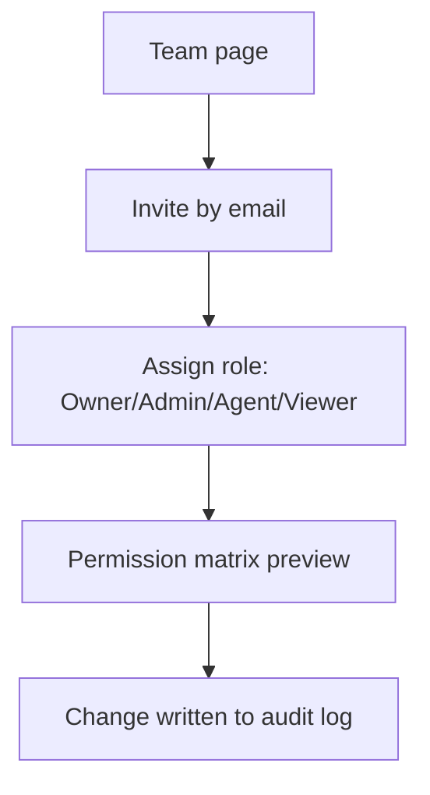

### D2. Audit Logs
Filter by actor/action/resource/date → immutable timeline → diff viewer → export CSV.

### D3. Knowledge Base
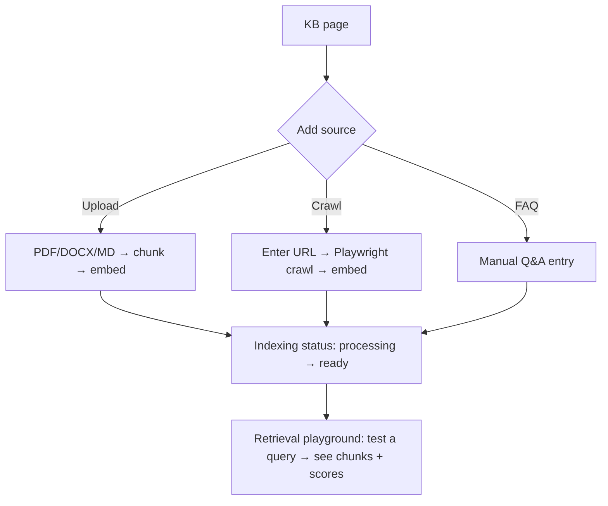

## E. Cross-Persona Journey Map (emotional arc)
| Stage | Customer feeling | Design response |
|-------|------------------|-----------------|
| Awareness | curious/skeptical | confident landing, social proof |
| First contact | impatient | instant AI first token |
| Getting help | needs trust | cited sources, confidence shown |
| Friction | frustrated | one-tap human handoff, no dead ends |
| Resolution | relieved | clear close, CSAT, follow-up |
| Return | expectant | remembered context, faster path |
