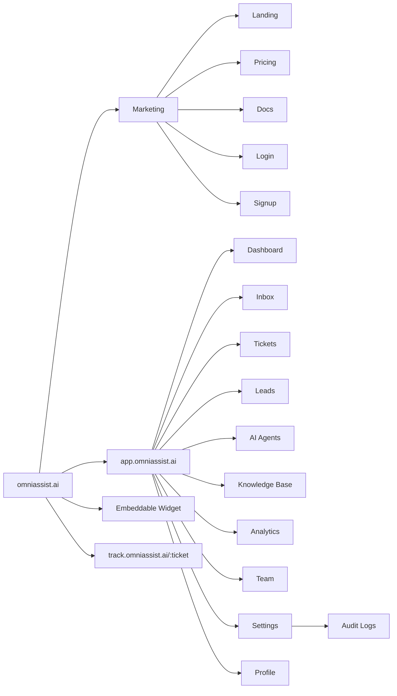

# OmniAssist AI — Information Architecture

> v1.0 · Navigation hierarchy, sitemap, URL structure, page taxonomy.

## 1. Top-Level Navigation (left rail, role-aware)

```
OmniAssist AI
├── ⌂ Dashboard            /dashboard
├── ✉ Inbox                /inbox            (badge: unread)
│     ├── All
│     ├── Website
│     ├── WhatsApp
│     ├── Email
│     └── Voice
├── ⊟ Tickets              /tickets          (badge: SLA at risk)
│     ├── My tickets
│     ├── Unassigned
│     ├── All
│     └── Saved views
├── ◆ Leads                /leads            (Sales)
│     ├── Pipeline (Kanban)
│     ├── All leads
│     └── Tasks / Follow-ups
├── ✦ AI Agents            /agents
│     ├── Support Agent
│     ├── Sales Agent
│     └── Playground / Sandbox
├── ▣ Knowledge Base       /knowledge-base
│     ├── Documents
│     ├── Crawled sites
│     ├── FAQs
│     └── Retrieval test
├── ▤ Analytics            /analytics
│     ├── Overview
│     ├── Conversations
│     ├── Tickets / SLA
│     ├── Sales
│     └── AI performance
├── ◫ Team                 /team             (Admin)
│     ├── Members
│     ├── Roles & permissions
│     └── Invites
└── ⚙ Settings             /settings
      ├── General / Branding
      ├── Channels
      ├── AI configuration
      ├── Notifications (Slack)
      ├── API keys
      ├── Billing & plan
      ├── Audit logs
      └── Security
```

**Global elements (top bar):** Org switcher · Global search / cmd-K · Notifications bell · Help · Profile menu.

## 2. Role-Based Visibility

| Nav item | Owner | Admin | Agent | Viewer |
|----------|:----:|:----:|:----:|:----:|
| Dashboard | ✅ | ✅ | ✅ | ✅ |
| Inbox | ✅ | ✅ | ✅ | 👁 read |
| Tickets | ✅ | ✅ | ✅ | 👁 |
| Leads | ✅ | ✅ | ✅(sales) | 👁 |
| AI Agents | ✅ | ✅ | 👁 | — |
| Knowledge Base | ✅ | ✅ | 👁/edit | 👁 |
| Analytics | ✅ | ✅ | self | ✅ |
| Team | ✅ | ✅ | — | — |
| Settings | ✅ | partial | — | — |
| Audit logs | ✅ | ✅ | — | — |

## 3. Sitemap



## 4. URL Structure

| Page | URL |
|------|-----|
| Dashboard | `/dashboard` |
| Inbox / conversation | `/inbox` · `/inbox/:conversationId` |
| Tickets / detail | `/tickets` · `/tickets/:id` |
| Leads / pipeline | `/leads` · `/leads/:id` |
| AI Agents / config | `/agents/:type` |
| KB / doc | `/knowledge-base` · `/knowledge-base/:docId` |
| Analytics | `/analytics/:tab` |
| Team | `/team` · `/team/roles` |
| Settings | `/settings/:section` |
| Profile | `/profile` |
| Public tracking | `/track/:ticketToken` |

## 5. Navigation Patterns

- **Left rail:** collapsible (264↔72px), icon+label, active state = brand bar + glow, sub-items expand in place.
- **Command palette (cmd-K):** jump to any page, search conversations/tickets/leads, run actions ("Assign to me", "Resolve", "Create lead").
- **Breadcrumbs:** on detail pages (`Tickets / #1042 / Details`).
- **Contextual right panel:** opens as a drawer on detail views (no full-page nav loss).
- **Mobile:** left rail → bottom tab bar (Dashboard, Inbox, Tickets, Analytics, More).

## 6. Empty / Error / Loading States (every list page)
- **Empty:** illustrated, one-line value prop, primary CTA (e.g. "Connect your first channel").
- **Loading:** skeletons matching final layout (no spinners on content).
- **Error:** friendly message + retry + support link.
- **No results:** clear filters CTA.
